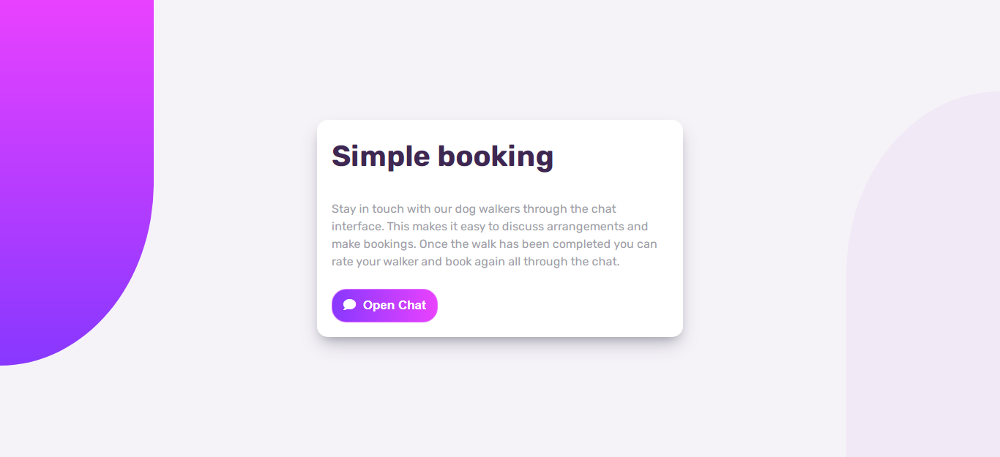
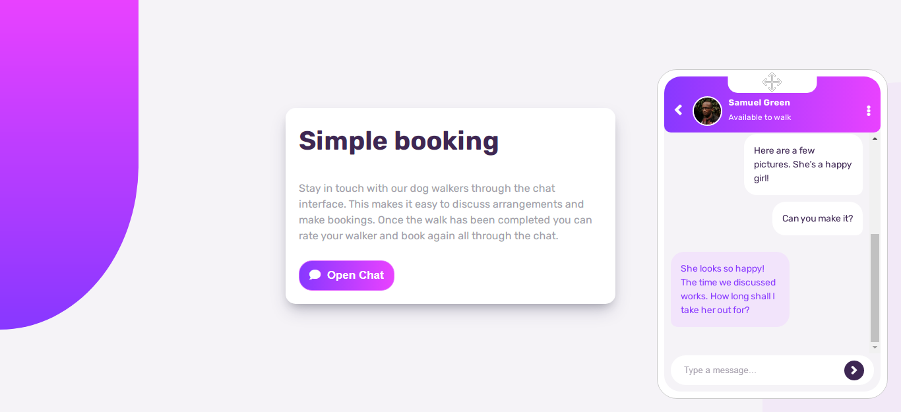
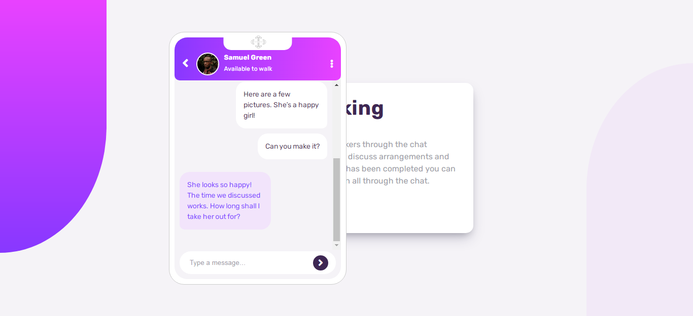
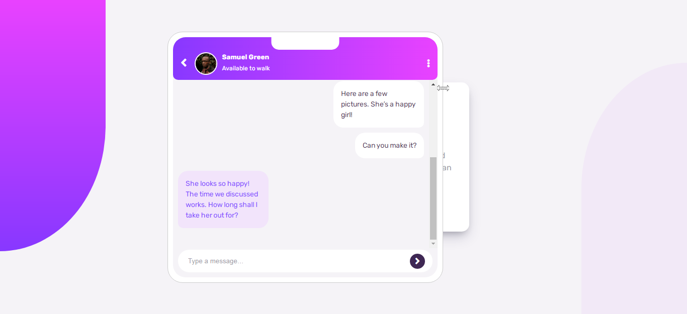
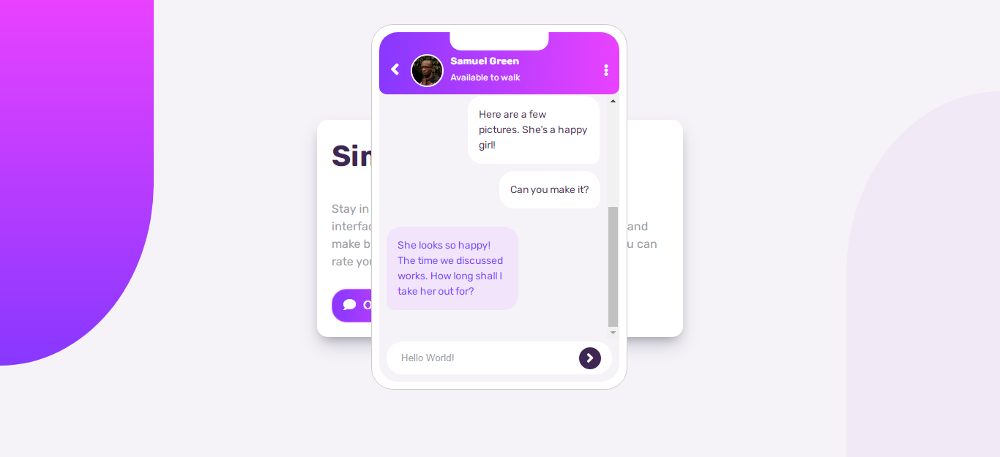
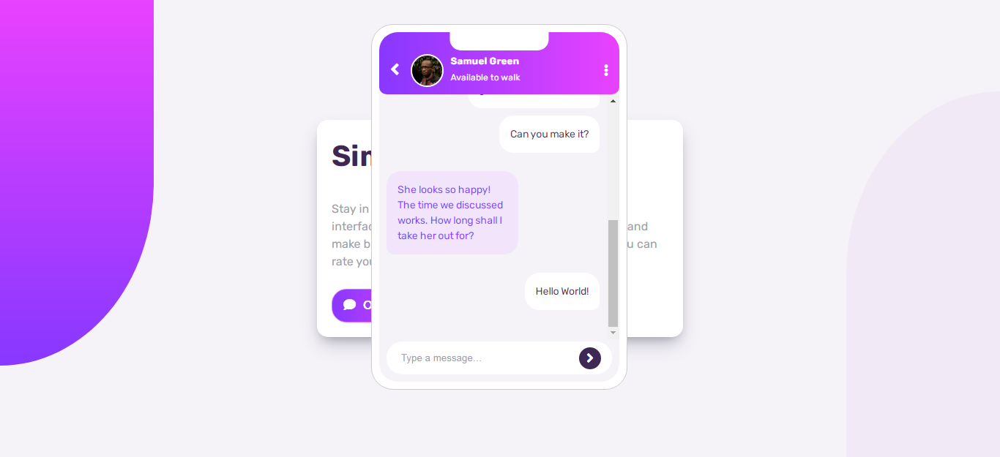

# Chatbox APP 

## Design preview and function of Chatbox APP
{:height="50%" width="50%"}
{:height="50%" width="50%"}
{:height="50%" width="50%"}
{:height="50%" width="50%"}
{:height="50%" width="50%"}
{:height="50%" width="50%"}
{:height="50%" width="50%"}

## About APP

Chatbox APP represents front-end app, with which is possible to manipulate:
- Moving chatbox around the screen
- Resize chatbox
- Is possible to generate new message and also clear chat

## Technology Used
- Vanilla JavaScript
- HTML
- CSS
